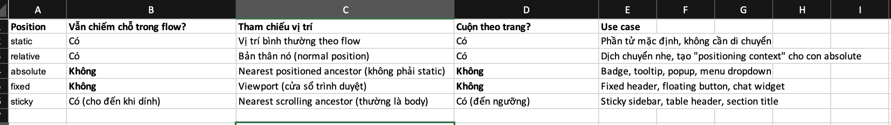

## Phần A:
# A1:

# Câu hỏi thêm
Khi nào absolute tham chiếu body?
Khi không có bất kỳ phần tử cha nào có position: relative/absolute/fixed/sticky.

Khi nào tham chiếu parent?
Khi parent (hoặc ông bà) có position là relative, absolute, fixed hoặc sticky.

"Nearest positioned ancestor" là gì?
Là phần tử cha gần nhất (theo thứ tự DOM) có giá trị position khác static. Đây là "ngữ cảnh định vị" mà absolute sẽ bám vào.

# A2:
--- TH1
.container { display: flex; }
.item { flex: 1; }
/* 4 items */
Bố cục:
4 items nằm trên cùng 1 hàng, mỗi item chiếm đúng 25% chiều rộng container (chia đều).
Text art:
┌──────┬──────┬──────┬──────┐
│  1   │  2   │  3   │  4   │
└──────┴──────┴──────┴──────┘
--- TH2
.container { display: flex; flex-wrap: wrap; }
.item { width: 45%; margin: 2.5%; }
/* 6 items */
Bố cục:
2 cột, mỗi hàng chứa 2 items
Tổng 3 hàng
Mỗi item chiếm 45% + margin 2.5% hai bên → tổng 50% mỗi item → vừa 2 item/hàng.

Text art:
┌──────────┐   ┌──────────┐
│    1     │   │    2     │
└──────────┘   └──────────┘

┌──────────┐   ┌──────────┐
│    3     │   │    4     │
└──────────┘   └──────────┘

┌──────────┐   ┌──────────┐
│    5     │   │    6     │
└──────────┘   └──────────┘

--TH3:
.container { display: flex; justify-content: space-between; align-items: center; }
/* 3 items */
Bố cục:
3 items nằm trên 1 hàng:

Item đầu tiên sát bên trái
Item cuối cùng sát bên phải
Item giữa nằm ở giữa (khoảng cách đều giữa các item)

┌───┐               ┌───┐               ┌───┐
│ 1 │               │ 2 │               │ 3 │
└───┘               └───┘               └───┘

--- TH4:
.container { display: grid; grid-template-columns: 200px 1fr 200px; gap: 20px; }
/* 3 items */
Bố cục:
1 hàng, 3 cột theo đúng kích thước định nghĩa:

Cột 1: 200px (item 1)
Cột 2: chiếm hết phần còn lại (item 2)
Cột 3: 200px (item 3)

┌────────┬──────────────────────┬────────┐
│  200px │       1fr            │  200px │
│  Item1 │       Item2          │  Item3 │
└────────┴──────────────────────┴────────┘

TH5:
.container { display: grid; grid-template-columns: repeat(3, 1fr); gap: 10px; }
/* 7 items */
Bố cục:

3 cột
3 hàng đầy đủ (9 ô)
Item 7 sẽ nằm ở hàng 3, cột 1
┌─────┬─────┬─────┐
│  1  │  2  │  3  │
├─────┼─────┼─────┤
│  4  │  5  │  6  │
├─────┼─────┼─────┤
│  7  │     │     │
└─────┴─────┴─────┘

# Phần C:
1. Navigation bar ngang (logo + menu + buttons)
→ Dùng Flexbox
Lý do: Navbar là bố cục một chiều (1D), chủ yếu sắp xếp các item theo hàng ngang. Flexbox rất mạnh về việc căn chỉnh ( justify-content, align-items), phân bố khoảng cách và responsive. Grid hơi thừa cho trường hợp này.

2. Lưới ảnh Instagram (3 cột đều nhau, số ảnh không biết trước)
→ Dùng Grid (hoặc Flexbox + flex-wrap)
Lý do: Đây là bố cục hai chiều (2D). Grid cho phép định nghĩa cột dễ dàng (grid-template-columns: repeat(3, 1fr)) và tự động xuống dòng. Khi số lượng item thay đổi, Grid vẫn giữ cấu trúc cột đều nhau rất tốt.

3. Layout blog: main content + sidebar
→ Kết hợp cả hai (hoặc Grid)
Lý do:

Dùng Grid là tối ưu nhất (grid-template-columns: 250px 1fr hoặc 1fr 300px).
Hoặc dùng Flexbox (display: flex) cũng rất phổ biến và dễ làm.
Grid nhỉnh hơn một chút vì kiểm soát được chiều cao và thứ tự dễ dàng hơn khi responsive.

4. Footer với 4 cột thông tin (Về chúng tôi, Liên kết, Hỗ trợ, Liên hệ)
→ Dùng Grid (ưu tiên) hoặc Flexbox
Lý do: Footer là bố cục nhiều cột đều nhau → Grid rất mạnh (grid-template-columns: repeat(4, 1fr)). Khi responsive (mobile), Grid cho phép dễ dàng thay đổi số cột (repeat(auto-fit, minmax(200px, 1fr))). Flexbox cũng làm tốt nhưng Grid sạch và mạnh hơn cho nhiều cột.

5. Card sản phẩm (ảnh trên, text giữa, nút dưới — nút luôn dính đáy)
→ Dùng Flexbox
Lý do: Card là bố cục một chiều theo chiều dọc (column). Dùng display: flex; flex-direction: column; kết hợp margin-top: auto trên nút "Mua" là cách kinh điển và hiệu quả nhất để nút luôn dính đáy card dù nội dung dài ngắn khác nhau. Grid có thể làm nhưng hơi phức tạp và không cần thiết cho trường hợp 1D này.

# Phần C2:
Lỗi 1: Cards không đều chiều cao — nút "Mua" bị nhảy lên/xuống
Mô tả lỗi:
Các card có chiều cao khác nhau vì nội dung (tiêu đề, mô tả) dài ngắn không bằng nhau. Khi dùng Flexbox thông thường, card không giãn đều chiều cao → nút "Mua" không nằm cùng một hàng.
Nguyên nhân:

.card chưa có display: flex và flex-direction: column.
Không có cơ chế làm các card bằng chiều cao.

Code sửa:
.card-container {
    display: flex;
    flex-wrap: wrap;
    gap: 20px;           /* thay vì margin */
}

.card {
    width: 30%;
    /* margin: 1.5%; */   /* thay bằng gap ở container */
    display: flex;
    flex-direction: column;
    background: white;
    border-radius: 8px;
    overflow: hidden;
    box-shadow: 0 4px 10px rgba(0,0,0,0.1);
}

.card img {
    width: 100%;
    height: 180px;
    object-fit: cover;
}

.card .btn {
    margin-top: auto;     /* Quan trọng nhất */
    padding: 12px;
}

Lỗi 2: Muốn items nằm giữa cả ngang lẫn dọc trong container 100vh, nhưng item vẫn dính góc trái trên
Mô tả lỗi:
Nội dung không căn giữa theo cả hai chiều dù đã dùng Flexbox.
Nguyên nhân:
Chỉ có display: flex, thiếu justify-content và align-items.
Code sửa:
.hero {
    height: 100vh;
    display: flex;
    justify-content: center;   /* Căn giữa ngang */
    align-items: center;       /* Căn giữa dọc */
    text-align: center;        /* (tùy chọn) */
}

.hero-content {
    /* text-align: center; */  /* không còn cần thiết */
}

Lỗi 3: Sidebar bị co lại khi content quá dài
Mô tả lỗi:
Khi nội dung main dài, sidebar bị thu hẹp thay vì giữ nguyên chiều rộng.
Nguyên nhân:
.sidebar chỉ có width: 250px nhưng Flexbox mặc định cho phép item co lại (flex-shrink: 1).
Code sửa:
.layout {
    display: flex;
    gap: 20px;
    min-height: 100vh;
}

.sidebar {
    width: 250px;
    flex-shrink: 0;           /* Không cho co lại */
    background: #f8fafc;
    padding: 20px;
}

.content {
    flex: 1;                  /* Chiếm hết phần còn lại */
    min-width: 0;             /* Cho phép text wrap tốt */
}
